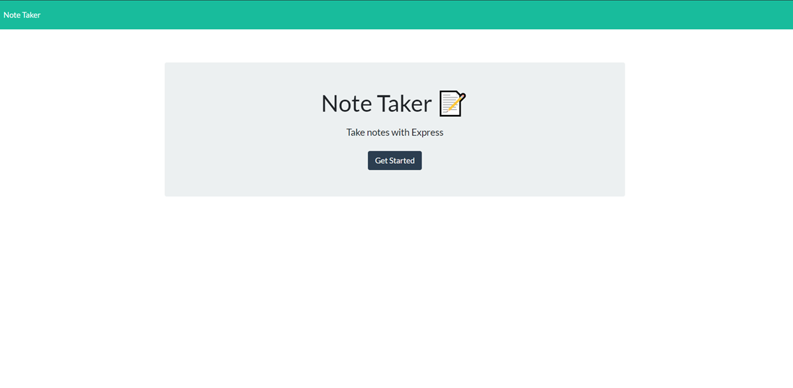

# Note-Taker-Write-and-Save-Notes

## Description
A simple application that allows for users to write and save and edit notes using express.js. This application is deployed on heroku and accepts post, get and delete requests. This is to store and display notes as well as to delete any undeeded notes.

## Table of Contents
  * [Installation](#installation)
  * [Usage](#usage)
  * [License](#license)
  * [How to Contribute](#how-to-contribute)
  * [Questions](#questions)

## Installation
Clone this application to your console then run either locally on port 3001 or via the deployeyd heroku link.
  

## Usage
.

## License
This application is covered under the MIT license.

## How to Contribute
Please contact me for further information if you wish to be a contributor on this project.

## Questions
Created by [Pasgen-Manley](https://github.com/Pasgen-Manley)

If you have any questions please contact me at [pasgen95@gmail.com](pasgen95@gmail.com)
